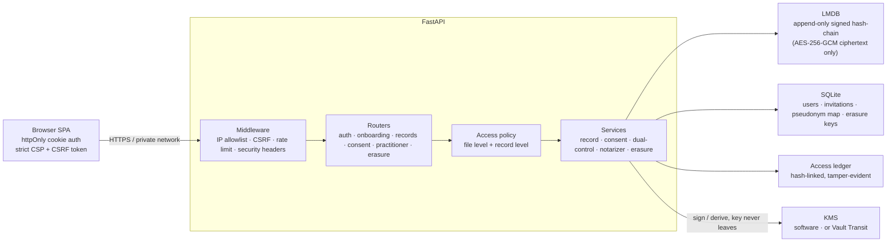
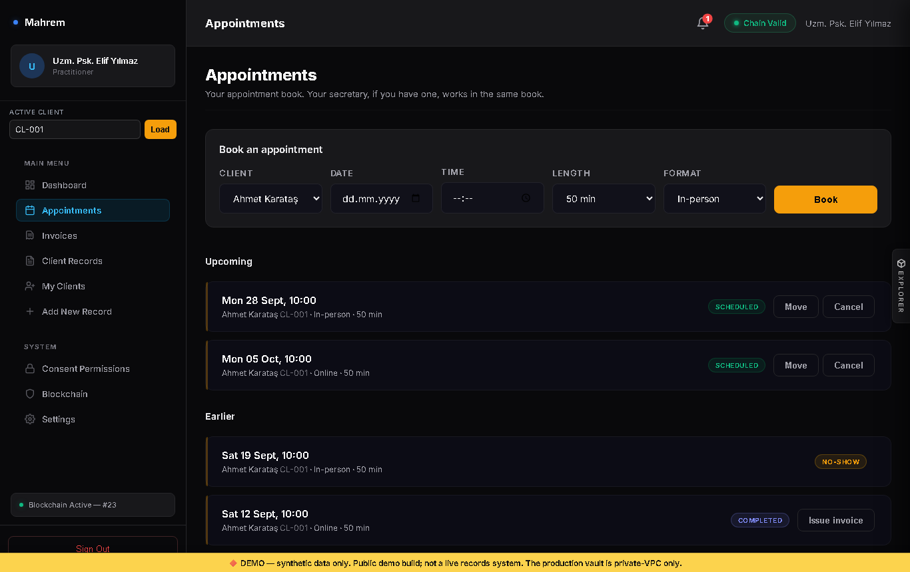
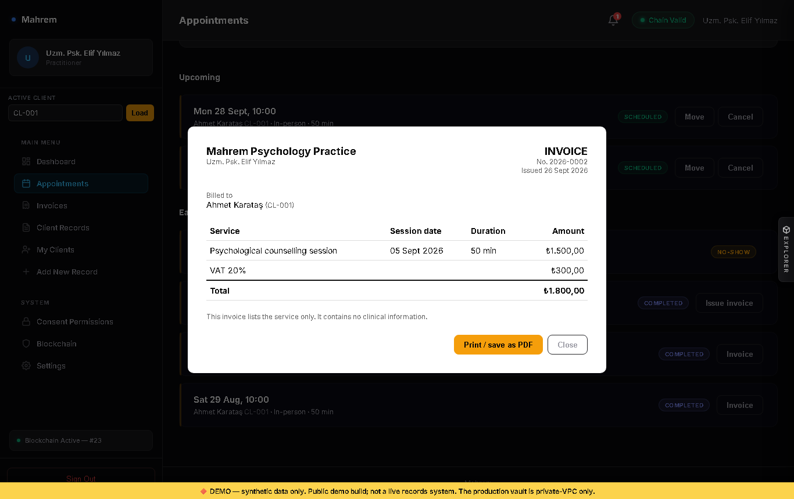
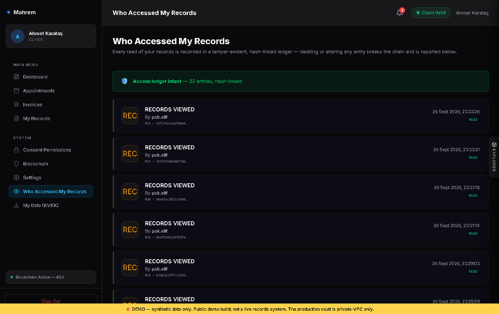

# Mahrem

> Confidential client records for independent psychologists. A FastAPI backend
> built around security engineering: **client-owned consent, one access policy on
> every endpoint, AES-256-GCM encryption at rest, a signed append-only hash-chain,
> a tamper-evident access ledger, passkeys and crypto-shredding erasure (KVKK/GDPR
> Art. 17)**, with **307 passing tests**.

*Mahrem* (Turkish: "private, not to be seen by others") is the pivot of an earlier
project, *VIP Health Vault*. The security core stayed; the domain became something
concrete: a psychologist in private practice and their clients.

## The problem

A therapist's notes are some of the most sensitive data a person has. Three things
matter:

1. **The client decides** what their practitioner may see, per record type and for a
   limited time — and can take it back.
2. **The practitioner's own process notes are theirs**; the client's private journal
   is the client's. Neither leaks to the other.
3. **Nobody reads records on their own authority** — not an administrator, not an
   auditor. Every read is recorded where it cannot be quietly deleted.

## Roles

| Role | What they can do |
| :-- | :-- |
| **Client** | Sees their own file, gives and revokes consent, keeps client-only records, sees who read their records. Accepts the KVKK privacy notice, downloads a copy of their data and can request erasure. Joins with an invitation code from their practitioner. |
| **Practitioner** | Invites clients, works only in the files of clients who gave consent — and only with the record types they consented to. Keeps the client profile, session notes and transcripts — a transcript is always practitioner-only. Runs an appointment book. |
| **Secretary** | Runs one practitioner's appointment book: books, moves and cancels sessions, and invoices completed ones. Sees clients' names, IDs and appointment times — never a record, a consent or a note. Invited by the practitioner. |
| **Admin / auditor / KVKK officer** | Run the system. Can read a client's records only with a dual-control co-signature from a second privileged person. Handle KVKK erasure requests and see the security alerts. |

## Access model

One module decides who sees what: [`core/services/access_policy.py`](core/services/access_policy.py)
([ADR-0003](docs/adr/0003-one-access-policy.md)). Every record endpoint calls it.

**File level.** A practitioner without any active consent from a client gets `403` for
everything in that client's file — the same answer as for a client who does not exist,
so client IDs cannot be probed.

**Record level.**

| Access level | Client | Practitioner |
| :-- | :-- | :-- |
| Client + Practitioner | ✅ | with consent for the record's type |
| Client Only | ✅ | never |
| Practitioner Only | never | only the author, with consent |

A password-protected record needs consent for *all* records, because its type is
unknown until it is decrypted; who may see it is stored outside the ciphertext, so a
client's locked journal is not even listed for the practitioner. Writing a record needs the same consent as reading it.
An invitation grants nothing: the client gives consent themselves.

## Security engineering at a glance

| Primitive | Implementation |
| :-- | :-- |
| **Access policy** | Pure functions, unit-tested without a database; file-level and record-level rules — [`core/services/access_policy.py`](core/services/access_policy.py) |
| **Consent** | Client-owned, per record type, time-bound, revocable — [`backend/routers/consent.py`](backend/routers/consent.py) |
| **Encryption at rest** | AES-256-GCM, fresh 96-bit nonce per write, KMS-derived per-client key — [`core/kms/software_provider.py`](core/kms/software_provider.py) |
| **Integrity** | Append-only chain: each block links to the previous hash and carries an HMAC-SHA256 signature and Merkle root — [`core/services/record_service.py`](core/services/record_service.py) |
| **Corrections** | A record is never overwritten; a correction is a new block and the original stays readable — [`backend/routers/records.py`](backend/routers/records.py) |
| **Access ledger** | Hash-linked, tamper-evident log of every read; the client sees it — [`database/audit_storage.py`](database/audit_storage.py) |
| **Dual control** | M-of-N co-signature before any operator reads a record — [`core/services/dual_control.py`](core/services/dual_control.py) |
| **Sign-in** | Argon2id passwords, WebAuthn/FIDO2 passkeys, TOTP, 5 attempts per IP per minute — [`core/webauthn.py`](core/webauthn.py), [`backend/middleware/rate_limiter.py`](backend/middleware/rate_limiter.py) |
| **Invoices** | One per completed session, numbered per practitioner and year, integer kuruş (no floats), a fixed service line and no free text — nothing clinical leaves the practice on an invoice; no payment tracking — [`core/services/invoicing.py`](core/services/invoicing.py) |
| **Onboarding** | No self-registration: single-use, expiring invitation codes stored only as a hash — [`backend/routers/onboarding.py`](backend/routers/onboarding.py) |
| **Pseudonymization** | The record store is keyed by an HMAC pseudonym, never the client ID — [`core/pseudonymization/service.py`](core/pseudonymization/service.py) |
| **KVKK screens** | Privacy notice with recorded explicit consent (per version), data export (Art. 11), erasure requests that can be closed as done only after the key is really destroyed — [`backend/routers/kvkk.py`](backend/routers/kvkk.py) |
| **Right to erasure** | Crypto-shredding: destroying a client's key makes their records unreadable while the chain stays valid — [`core/services/erasure_service.py`](core/services/erasure_service.py) |
| **Browser** | Output encoding at every HTML sink, strict CSP without inline script, httpOnly cookies, CSRF double-submit — [`docs/DOM_XSS_SELF_AUDIT.md`](docs/DOM_XSS_SELF_AUDIT.md) |

## Architecture



Why a local signed hash-chain and not a public blockchain: one practice, one trust
boundary, and confidentiality as the goal. A public chain would make the data
permanent and often public — the opposite of what therapy notes need
([ADR-0001](docs/adr/0001-offchain-storage-onchain-anchoring.md)). The app runs as a
single node on purpose ([ADR-0002](docs/adr/0002-single-node-deployment.md)).

## Interface

Captured from the Docker demo: the practitioner, the secretary, a client on their
first sign-in, and an administrator who cannot read anything on their own. Every
frame is captioned.


| Sign in | Practitioner dashboard (clients, next appointments) |
| :---: | :---: |
|  |  |

| The client's file (a transcript only the practitioner sees) | Appointment book |
| :---: | :---: |
|  |  |

| Invoice (nothing clinical on it) | Tamper-evident access ledger (the client's view) |
| :---: | :---: |
|  |  |

## Bugs I found and fixed

Each one was reproduced first, then fixed with a test that fails on the old code. The
full history is in the [CHANGELOG](CHANGELOG.md).

- **A new role would have read every record.** The access policy allowed every role
  other than client and practitioner, on the assumption that the rest were operators
  already stopped by dual control. Adding a secretary exposed it: before the fix, a
  secretary got record data or consent lists from six endpoints. The policy now lists
  the roles that may see records and denies everything else.
- **IDOR on the single-record endpoint.** `GET /records/{client}/{block}` only checked
  that a client stayed in their own file, so any practitioner could read any client's
  unprotected records by walking block numbers — with no consent at all. The access
  rules had been copied into each endpoint and the copies drifted apart. Fixed by moving
  every rule into one policy module that all endpoints call.
- **The sign-in rate limit never applied.** It matched `/api/auth/login`, but the API
  lives under `/api/v1`, so passwords could be guessed without limit. It now covers
  password login, passkey login and invitation codes.
- **Practitioners could write into any client's file** without consent, and read any
  client's chain status and notifications.
- **A client's locked journal showed up in the practitioner's list** as an "ENCRYPTED
  RECORD" row: its access level was inside the ciphertext, so the list could not tell
  it apart. The audience is now stored outside the ciphertext.
- **`MANDATORY_FIDO2` enforced nothing.** It returned a flag no code read, and only for
  admins and clients; every password login still worked. Now an account with a passkey
  must use it, for every role, and one without is taken straight to enrolment.
- **CI had not run the tests for a month.** Since 21 August a lint error failed the
  first step, so every later step was skipped; a red build that "always fails" hid that
  nothing was being tested.
- **Stored XSS** in the confidential-record and attachment views (a crafted file name,
  or a quote in the file type inside ``), found in a second,
  line-by-line self-audit after a first one had missed them. The CI guard changed from
  a denylist to a rule: every untrusted `${…}` must be escaped or explicitly reviewed.
- **Reflected DOM XSS** in the command palette's search box.
- **Passkey login accepted any known credential** without verifying the assertion.
- **A fake "anchor"** — a random number presented as a transaction hash — replaced by a
  real HMAC signature of the Merkle root.
- **Silent audit-log overwrite**: ledger entries were keyed on `time.time_ns()`, whose
  resolution on Windows is ~15.6 ms, so two reads in one tick overwrote each other.
- **Clinical detail in a plaintext notification**, readable from the SQL store without
  the chain key. Notifications no longer carry clinical content.

**Honest limits.** The design assumes the attacker knows the code and can reach the
service. Within that, keys can live on the app host, tampering is *detected* rather
than prevented, there is no high availability, and there has been no external
penetration test. The full list is in
[THREAT_MODEL.md](docs/THREAT_MODEL.md#4-trust-assumptions--residual-risk).

## Quick start

Requires Python 3.10+.

```bash
git clone https://github.com/calsgnkadir/mahrem.git
cd mahrem
pip install -r requirements.txt
ENVIRONMENT=development VHV_DEMO_MODE=true python -m uvicorn backend.main:app --host 127.0.0.1 --port 8000
```

Or with Docker:

```bash
docker compose -f docker-compose.yml -f docker-compose.demo.yml up --build
```

Then open `http://127.0.0.1:8000`.

### Demo accounts

Demo mode seeds these accounts and one example file: client `CL-001`, five weeks of
CBT for panic on the commute — the client profile, treatment plan, session notes and
homework. The file also holds a practitioner-only process note and session transcript,
and the client's password-protected journal entry (password `DemoRecord@2026!`). Nothing is seeded outside demo mode, and an existing
file is never overwritten.

| Account | Password | Shows |
| :--- | :--- | :--- |
| `psk.elif` | `Practitioner@2026!` | the practitioner dashboard, client invitations, consent-scoped records |
| `client001` | `Client@2026Secure!` | the client's own file, consent, appointments, who accessed my records |
| `secretary.ayse` | `Secretary@2026!` | the appointment book — and nothing from any client's file |
| `admin` | `Admin@2026Secure!` | records locked by dual control until a second person co-signs |
| `sec.officer` | `SecOfficer@2026!` | the co-signing side of dual control |

Appointments: the demo file's weekly sessions are in the book (three completed, one
missed) with two upcoming, booked by the secretary. Two completed sessions are
invoiced; the third is left for you to invoice.

The app is meant for a private network. Demo mode relaxes that (IP allowlist off,
auto-generated key), so never use it for real records — see
[PRIVATE_VPC_DEPLOYMENT.md](docs/PRIVATE_VPC_DEPLOYMENT.md).

## Tests

```bash
pip install -r requirements-dev.txt
python -m unittest discover -s tests -p "test_*.py"
```

CI runs Ruff, Bandit and the full suite on Python 3.10 and 3.11.

## Documentation

- [Threat model](docs/THREAT_MODEL.md) · [Consent flow](docs/CONSENT_FLOW.md) · [DOM XSS self-audit](docs/DOM_XSS_SELF_AUDIT.md)
- [KVKK / GDPR compliance](docs/GDPR_KVKK_COMPLIANCE.md) · [DPIA](docs/DPIA.md)
- [Key management](docs/KEY_MANAGEMENT.md) · [Key rotation runbook](docs/KEY_ROTATION_RUNBOOK.md)
- Decisions: [ADR-0001](docs/adr/0001-offchain-storage-onchain-anchoring.md) · [ADR-0002](docs/adr/0002-single-node-deployment.md) · [ADR-0003](docs/adr/0003-one-access-policy.md)

## Roadmap

| Status | Item |
| :---: | :--- |
| ✅ | One access policy; practitioner-only notes; client-only records |
| ✅ | Client invitations; practitioner dashboard with the client list |
| ✅ | Appointment book with a secretary role that never sees records |
| ✅ | Invoices for completed sessions, printable / PDF |
| ✅ | KVKK screens: privacy notice and consent, data export, erasure requests, security alerts |
| ✅ | Encryption at rest, signed hash-chain, access ledger, crypto-shred erasure |
| 📋 | Client journal entries written from the client's own screen |
| 📋 | Faster reads on long files (one key derivation per request instead of per block) |
| 📋 | External anchoring of the Merkle root (RFC 3161 timestamp) |
