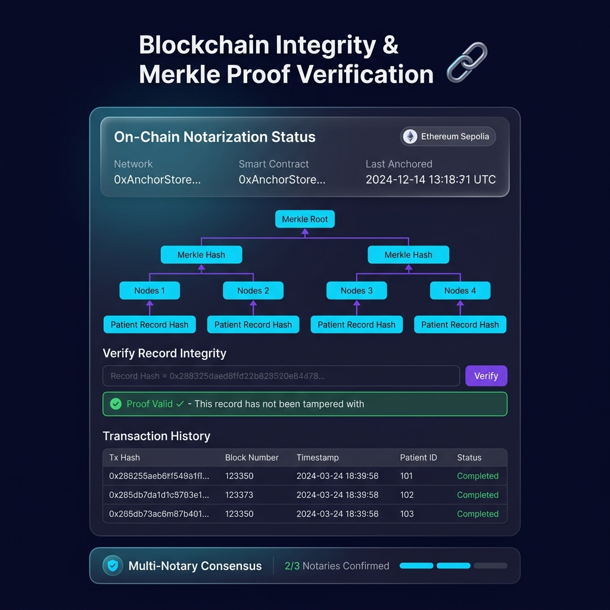
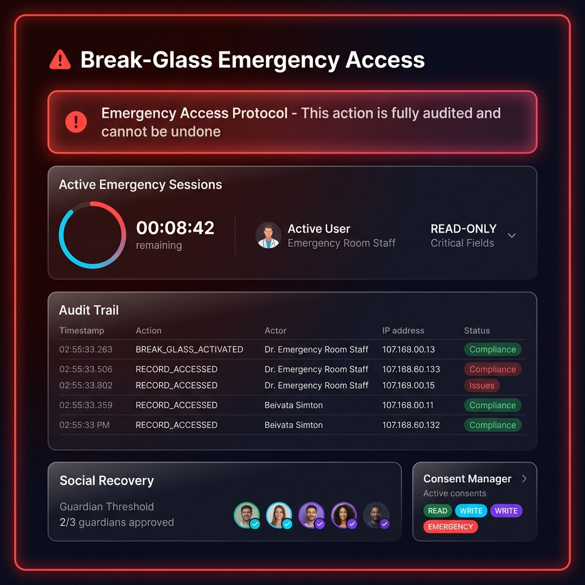

# VIP Health Vault (v5.0.0) — Stealth VIP Health Privacy Platform

> **Isolated, High-Security Medical Privacy Vault for High-Net-Worth Individuals, Executive Cabinets, and Defense Personnel.**

---

## 📸 Interface & System Showcase

> 💡 **Public Ingress Architecture Note**: By security design, **VIP Health Vault** enforces strict private subnet CIDR isolation (`IPAllowlistMiddleware`) and air-gapped hardware passkeys. As a consequence, the application cannot and should not be hosted on public SaaS URLs (`0.0.0.0/0`). Below is the complete interface walkthrough and system showcase for local demonstration.

| Stealth Login & Passkey Authentication | VIP Executive Clinical Dashboard |
| :---: | :---: |
|  |  |

| Merkle Root Cryptographic Proof | Emergency Access Audit Controls |
| :---: | :---: |
|  |  |

---

## 🛡️ Feature Implementation & Security Defense Matrix

To maintain 100% technical honesty during code reviews and security audits, the system explicitly distinguishes between **natively working code implementations** and **pluggable enterprise abstractions**:

| Security Component | Implementation Status | Enforcing Class / File | Technical Guarantee |
| :--- | :---: | :--- | :--- |
| **Local Merkle Hash-Chain** | **LIVE / WORKING** | `core.services.notarizer.Notarizer` | Local Merkle root signed hash-chain (`ADR-0001`). Zero Web3/RPC dependencies. |
| **Passkey / FIDO2 Auth** | **LIVE / WORKING** | `backend.routers.auth.login_webauthn_credential` | Native browser WebAuthn API + `secp256r1` signature verification in Python. |
| **Dual-Control M-of-N Engine** | **LIVE / WORKING** | `core.services.dual_control.DualControlEngine` | Blocks raw admin access (`403 Forbidden`) without Security Officer co-signature. |
| **Network IP Allowlist** | **LIVE / WORKING** | `backend.middleware.ip_allowlist.resolve_secure_client_ip` | Direct socket peer host verification. Prevents `X-Forwarded-For` header spoofing. |
| **Immutable Decrypt Access Log** | **LIVE / WORKING** | `backend.routers.records.decrypt_record` | Writes immutable `RECORD_DECRYPTED` log entry to LMDB and SQLite access logs. |
| **Hardware Passkey Revocation** | **LIVE / WORKING** | `POST /api/v1/auth/webauthn/revoke` | Revokes stolen hardware credentials with Dual-Control authorization. |
| **KMS Envelope Encryption** | **PLUGGABLE ABSTRACTION** | `core.kms.provider.KMSProvider` / `SoftwareKMSProvider` | Software PBKDF2 provider natively working; AWS KMS / HashiCorp Vault drivers scaffolded. |

---

## ⚡ Quick Start

### Prerequisites
- Python 3.10+
- Virtualenv (`python -m venv venv`)

### Installation & Run

```bash
# 1. Clone repository
git clone https://github.com/calsgnkadir/health-blockchain.git
cd health-blockchain

# 2. Install dependencies
pip install -r requirements.txt

# 3. Launch application server
python -m uvicorn backend.main:app --host 127.0.0.1 --port 8000
```

Access the Stealth Vault Web Console at: `http://127.0.0.1:8000`

---

## 🧪 Running Automated Test Suite

```bash
python -m unittest discover -s tests -p "test_*.py"
```

---

## ⚖️ Compliance & Governance

- **GDPR / KVKK**: Complete compliance via identity pseudonymization, local data sovereignty, and key destruction erasure.
- **ISO 27001 / INFOSEC**: Full cryptographic access audit logs and Dual-Control co-signatures for privileged operations.
- **Institutional Gate**: Satisfies Private VPC isolation and out-of-band identity onboarding requirements ([PRIVATE_VPC_DEPLOYMENT.md](docs/PRIVATE_VPC_DEPLOYMENT.md)).
