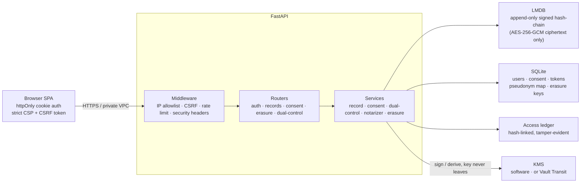
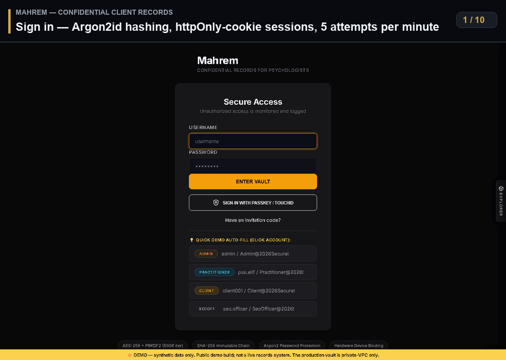
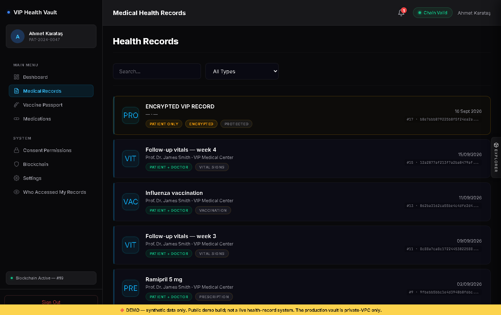
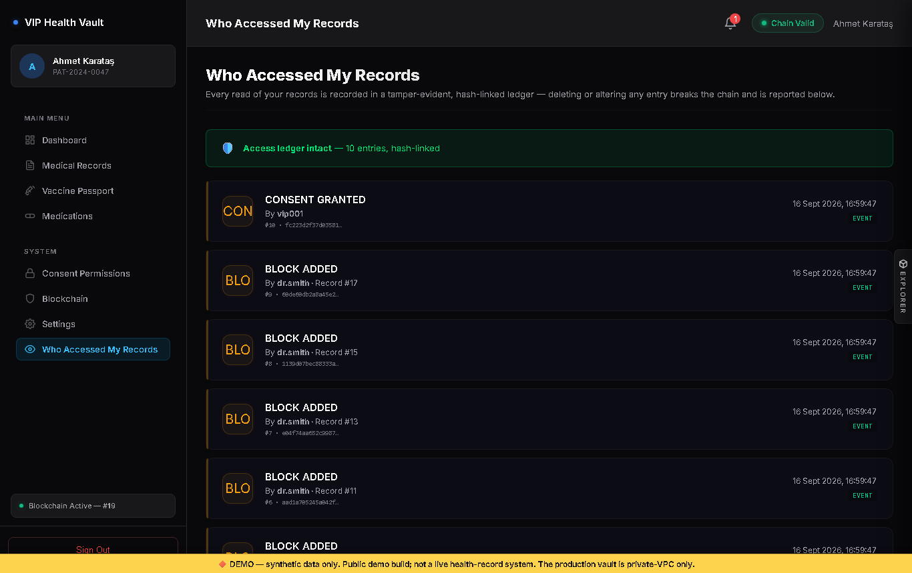

# VIP Health Vault

> A single-tenant **FastAPI health-records vault** built around real security
> engineering — **FIDO2/WebAuthn passkeys, dual-control (M-of-N) access,
> AES-256-GCM encryption at rest, a tamper-evident hash-linked audit ledger, and
> crypto-shredding erasure (GDPR/KVKK Art. 17)** — with **182 passing tests**.

*The scenario — a private, isolated vault for a small number of high-sensitivity
individuals — is flavor. The security engineering is the point.*

## 🔐 Security engineering at a glance

| Primitive | Implementation (verifiable in code) |
| :-- | :-- |
| **Passwordless / MFA** | WebAuthn/FIDO2 assertion verification (ES256 / secp256r1): single-use challenge, origin + rpId binding, User-Present flag, sign-counter clone detection — [`core/webauthn.py`](core/webauthn.py) |
| **Encryption at rest** | AES-256-GCM, a fresh 96-bit nonce per write, KMS-derived per-patient key — [`core/kms/software_provider.py`](core/kms/software_provider.py) |
| **Passwords** | Argon2id (bcrypt / PBKDF2 fallback), all salted — [`core/security.py`](core/security.py) |
| **Integrity** | Per-block HMAC-SHA256 signature + Merkle root, `previous_hash → prior block's hash`, verified on every block — [`core/services/record_service.py`](core/services/record_service.py) |
| **Access control** | Server-side role checks (role re-loaded from the DB, never trusted from token claims) + patient-owned consent — [`backend/dependencies.py`](backend/dependencies.py) |
| **Dual-Control** | M-of-N co-signature gates raw record access for non-clinical operators — [`core/services/dual_control.py`](core/services/dual_control.py) |
| **Audit** | Hash-linked, tamper-evident access ledger — deleting or altering an entry breaks the chain — [`database/audit_storage.py`](database/audit_storage.py) |
| **Right to erasure** | Crypto-shredding: destroy a per-patient key → records permanently undecryptable, chain intact (GDPR/KVKK Art. 17) — [`core/services/erasure_service.py`](core/services/erasure_service.py) |
| **Externally-held key** | Optional HashiCorp Vault Transit — the signing key never enters the app — [`core/kms/vault_provider.py`](core/kms/vault_provider.py) |

## 🏗️ Architecture



---

## 📸 Interface

Captured from a running instance seeded by demo mode — the chart, the trends and the
hashes below are what the application actually produces.

### 90-second walkthrough

Sign in → dashboard → AES-encrypted record → access ledger → chain verification →
and the governance side: even an admin gets no patient data without an M-of-N
dual-control co-signature. Every frame is self-captioned.



### Detail shots

| Stealth login | VIP patient dashboard (vitals, allergy banner, chain integrity) |
| :---: | :---: |
|  |  |

| Medical records (encrypted, access-scoped) | Tamper-evident access ledger |
| :---: | :---: |
|  |  |

---

> 💡 **Public Ingress Architecture Note**: By security design, **VIP Health Vault** enforces strict private subnet CIDR isolation (`IPAllowlistMiddleware`) and per-device hardware passkeys. As a consequence, the application cannot and should not be hosted on public SaaS URLs (`0.0.0.0/0`) — it is intended to be run locally or inside a private VPC. See [Quick Start](#-quick-start) to bring the vault up on your own machine.

---

## 🛡️ Feature Implementation & Security Defense Matrix

To maintain 100% technical honesty during code reviews and security audits, the system explicitly distinguishes between **natively working code implementations** and **pluggable enterprise abstractions**:

| Security Component | Implementation Status | Enforcing Class / File | Technical Guarantee |
| :--- | :---: | :--- | :--- |
| **Local Merkle Hash-Chain** | **LIVE / WORKING** | `core.services.notarizer.BlockchainNotarizer` | Local Merkle-root hash-chain (`ADR-0001`), re-anchored after every committed write. The anchor is an **HMAC-SHA256 signature of the Merkle root** under the server's KMS key — a verifiable commitment only the key-holder can produce, deliberately not a public-chain transaction hash. Verification recomputes and checks that signature, so a tampered block fails as "Anchor signature invalid." Zero Web3/RPC dependencies. Per-record inclusion proofs are verifiable from the record view (`GET /api/v1/records/proof/{patient_id}/{block_index}`). |
| **Passkey / FIDO2 Auth** | **LIVE / WORKING** | `core.webauthn.verify_assertion` | Native browser WebAuthn API + `secp256r1` (ES256) assertion verification in Python: single-use challenge, origin and rpId binding, User Present flag, and signature-counter clone detection. No credential is ever pre-seeded. |
| **Out-of-Band Onboarding** | **LIVE / WORKING** | `backend.routers.onboarding` | No account is self-registered. A privileged operator provisions a vetted account (`PENDING_ONBOARDING`); it cannot log in until the holder redeems a single-use, expiring enrollment token delivered out of band. The token is stored only as a hash, and login is refused for any non-`ACTIVE_ENROLLED` account. |
| **Right-to-be-Forgotten (Crypto-Shred)** | **LIVE / WORKING** | `backend.routers.erasure` / `core.services.erasure_service` | GDPR/KVKK Art. 17 on an append-only chain: the at-rest key is derived from the KMS root AND a per-patient secret, so `POST /api/v1/erasure/{patient_id}` destroys that secret — every record encrypted under it becomes permanently undecryptable (read-back returns an "erased" marker) while the chain and its signatures stay valid. Privileged + Dual-Control gated; irreversible. |
| **Encryption at Rest** | **LIVE / WORKING** | `core.services.record_service._encrypt_at_rest` | Every clinical payload is AES-256-GCM encrypted on disk under a KMS-derived, patient-scoped key (`core.security.derive_rest_secret`). The chain store holds only ciphertext — a stolen `projects/` backup cannot be read **as long as the signing key is kept out of that backup** (env var or OS keyring, not the on-disk `.private_key` file). Production refuses to boot with an unconfigured key rather than silently minting one. The server decrypts for authorized sessions; a per-record password layer adds server-blind confidentiality on top. Key backup & rotation: [KEY_MANAGEMENT.md](docs/KEY_MANAGEMENT.md). |
| **Tamper-Evident Access Ledger** | **LIVE / WORKING** | `database.audit_storage.append_access_log` / `verify_access_log_integrity` | Every read and clinician view is a hash-linked entry carrying `seq` + `prev_hash` + `hash`. Deleting or altering any past access event breaks the chain and is reported by sequence number. The record owner reads their own trail and its integrity verdict — you cannot silently erase having looked at a VIP's chart. |
| **Append-Only Medical Correction** | **LIVE / WORKING** | `POST /api/v1/records/{patient_id}/{block_index}/correct` | A record is never overwritten. A correction is appended as a new block referencing the original; both versions stay on the chain, the record carries the correction's author and reason, and the superseded content is still retrievable (`?version=original`). This is why append-only fits medicine — a clinical record is corrected, not rewritten. |
| **Patient-Controlled Consent** | **LIVE / WORKING** | `backend.routers.consent._require_consent_owner` | Only the patient who owns the chart may grant or revoke clinical access — practitioners and administrators cannot self-authorize. |
| **Dual-Control M-of-N Engine** | **LIVE / WORKING** | `core.services.dual_control.DualControlEngine` | Blocks raw record access by every non-clinical operator role — admin, auditor, security officer — with `403 Forbidden` until a *different* privileged principal co-signs. Self-approval is rejected; tokens are bound to one patient and expire. Drivable from the Dual-Control Access screen. |
| **Network IP Allowlist** | **LIVE / WORKING** | `backend.middleware.ip_allowlist.resolve_secure_client_ip` | Direct socket peer host verification. Prevents `X-Forwarded-For` header spoofing. |
| **Immutable Decrypt Access Log** | **LIVE / WORKING** | `backend.routers.records.decrypt_record` | Writes immutable `RECORD_DECRYPTED` log entry to LMDB and SQLite access logs. |
| **Hardware Passkey Revocation** | **LIVE / WORKING** | `POST /api/v1/auth/webauthn/revoke` | Revokes stolen hardware credentials with Dual-Control authorization. |
| **XSS Defence in Depth** | **LIVE / WORKING** | `backend.middleware.xss_protection` / `static.js.modules.actions` | Clinical text is stored verbatim and escaped at render; the CSP then forbids inline script outright (`script-src 'self'`, no `unsafe-inline`, no `unsafe-eval`), so encoding and execution are two independent layers. |
| **Encrypted File Attachments** | **LIVE / WORKING** | `core.services.attachment_store.AttachmentStore` | Record attachments (e.g. imaging/DICOM) are AES-encrypted, then kept in the same LMDB store as the chain, content-addressed by the SHA-256 of the ciphertext. No external service, no network egress — the blob sits on the same disk as the records it belongs to. |
| **Externally-Held Signing Key** | **LIVE / WORKING** | `core.kms.vault_provider.VaultTransitKMSProvider` | Every key use is a MAC through `KMSProvider.mac()`, so the signing key can live outside this process. With `KMS_PROVIDER=vault` the MAC is computed by HashiCorp Vault's Transit engine (`/transit/hmac`) — the key never enters the app, closing the "a rogue admin has both the store and the key" gap. Fails closed if Vault is unreachable (never signs locally). The default software provider keeps the key on-host; AWS KMS is stubbed. |

---

## 🧠 Engineering decisions & bugs I found and fixed

**Why a local HMAC-signed Merkle hash-chain, not a public blockchain** ([ADR-0001](docs/adr/0001-offchain-storage-onchain-anchoring.md)) — one institution, one trust boundary, and confidentiality as the core goal. A public chain has no one to reach consensus with, charges gas, and writes data that is permanent and often publicly readable — the opposite of what health data needs. So tamper-evidence comes from a **local, signed, append-only hash-chain** (each block links `previous_hash → prior hash`, with an HMAC-SHA256 signature and Merkle root) over **AES-256-GCM ciphertext held off-chain** in LMDB. Integrity is a hash chain; authenticity is a keyed signature; both are verified on every block. See also [ADR-0002](docs/adr/0002-single-node-deployment.md) on the deliberate single-node posture.

**Real bugs found and fixed** (each reproduced against a running instance, then covered by a regression test — see the [CHANGELOG](CHANGELOG.md)):

- **FIDO2 enrolment deadlock** — `MANDATORY_FIDO2=true` refused every password login without a passkey, but a passkey can only be enrolled *after* logging in → a fresh account was permanently locked out. Fixed with a one-time enrolment grace.
- **Passkey login accepted any known credential** — the WebAuthn login endpoint issued a session token without verifying the assertion (challenge, signature, origin, rpId, counter). Now cryptographically verified before any token is issued; the seeded demo credential is deleted on startup.
- **Fake notarizer anchor** — the "anchor" was `secrets.token_hex(32)` (a random number dressed up as a transaction hash). Replaced with a real HMAC-SHA256 signature of the Merkle root, verified in constant time.
- **PHI leak in a plaintext notification** — a new-prescription notification embedded the medication name, and notifications live in the SQL store in plaintext — leaking a drug the chain had encrypted. Notifications now carry no clinical content.
- **Silent audit-log overwrite** — the tamper-evident access ledger keyed entries on `time.time_ns()`, whose resolution on Windows is ~15.6 ms; two reads in the same tick overwrote each other. Re-keyed on a monotonic sequence number.
- **Privileged dashboard hardcoded one patient** — admin/clinician views defaulted to `VIP-001` and hit the Dual-Control gate on login. Replaced with a patient selector.
- **Reflected DOM XSS in the search box** — a source→sink self-audit of the frontend found the command palette wrote the raw search value into `innerHTML` on its "no results" branch (`` typed into search executed in the victim's session; httpOnly cookies narrow but don't remove the impact). Fixed with contextual output encoding, hardened seven more error sinks the same way, and added a static CI guard so it can't regress — see [DOM_XSS_SELF_AUDIT.md](docs/DOM_XSS_SELF_AUDIT.md).
- **XSS round 2: what the first audit missed** — reading every template line by line (not only those reached from the obvious sources) found stored XSS in the confidential-record view and the attachment view (a crafted file name, or a quote in the file type inside ``), plus an error-message variant the first guard could not match. All escaped at the point they are built; the server now validates attachment fields and runs corrections through the same validation as new records. The CI guard went from a denylist of known strings to a rule: every untrusted `${…}` must be escaped or explicitly reviewed.

**Security assumptions & residual risk (honest limits).** The design assumes the attacker knows the whole system (the code is public) and can reach the service — security does not rely on staying hidden. Under that assumption, dual-control, at-rest encryption, pseudonymization, the signed hash-chain and crypto-shred still protect the data. The build also has deliberate limits for its tier: keys can live on the app host, tampering is *detected* rather than *blocked*, there is no high-availability/DoS protection, and no external penetration test. These are scope boundaries, not defects — the full list, and what a real production deployment would add, is in [THREAT_MODEL.md](docs/THREAT_MODEL.md#4-trust-assumptions--residual-risk).

## ⚡ Quick Start

### Prerequisites
- Python 3.10+
- Virtualenv (`python -m venv venv`)

### Installation & Run

```bash
# 1. Clone repository
git clone https://github.com/calsgnkadir/health-blockchain.git
cd health-blockchain

# 2. Install dependencies
pip install -r requirements.txt

# 3. Launch application server in demo mode
ENVIRONMENT=development VHV_DEMO_MODE=true   python -m uvicorn backend.main:app --host 127.0.0.1 --port 8000
```

Access the Stealth Vault Web Console at: `http://127.0.0.1:8000`

### Demo Mode

`VHV_DEMO_MODE=true` seeds four demo accounts and one worked example chart for
patient `VIP-001` — four weeks of a cardiology follow-up with vital sign trends, a
severe allergy, a prescription, a vaccination and one AES-256 encrypted record — so
a first run opens on a working vault rather than eight empty panels. Nothing is
seeded in any other configuration, and an existing chart is never overwritten.

| Account | Password | Shows |
| :--- | :--- | :--- |
| `vip001` | `VIPPatient@2026!` | the patient's own chart, consent grants, passkey enrolment |
| `dr.smith` | `Doctor@2026Secure!` | consented clinical access and the Break-Glass override |
| `admin` | `Admin@2026Secure!` | records locked by Dual-Control until a second principal co-signs |
| `sec.officer` | `SecOfficer@2026!` | the co-signing side of Dual-Control |

The client's encrypted journal entry opens with `DemoRecord@2026!`.

Optional environment variables: `VHV_WEBAUTHN_RP_ID` / `VHV_WEBAUTHN_ORIGINS`
pin passkey verification to a specific host — see `.env.example`.

---

## 🧪 Running Automated Test Suite

```bash
python -m unittest discover -s tests -p "test_*.py"
```

---

## ⚖️ Compliance & Governance

- **GDPR / KVKK (live)**: Local data sovereignty (records never leave the private deployment), time-bound consent with automatic expiry, and a full cryptographic access audit trail.
- **GDPR / KVKK (live)**: Identity pseudonymization is wired into the write path — the clinical chain store is keyed by a deterministic `anon_id` (HMAC of the patient id), never the raw identifier, so the block store holds only opaque pseudonyms; an authorized admin resolves the mapping, and it is verifiable end-to-end.
- **GDPR / KVKK (live)**: Key-destruction erasure (right to be forgotten) is wired — `POST /api/v1/erasure/{patient_id}` crypto-shreds a patient by destroying their per-patient key, leaving the append-only chain intact; see `docs/GDPR_KVKK_COMPLIANCE.md`.
- **ISO 27001 / INFOSEC**: Cryptographic access audit logs and Dual-Control co-signatures for privileged operations.
- **Institutional Gate**: Satisfies Private VPC isolation and out-of-band identity onboarding requirements ([PRIVATE_VPC_DEPLOYMENT.md](docs/PRIVATE_VPC_DEPLOYMENT.md)).

---

## 🧭 Roadmap

The vault stands on two pillars: a **tamper-evident chain** (integrity) and
**confidentiality** for VIP health records. Work is sequenced so each step is
independently shippable with the test suite green.

| Status | Item | Pillar |
| :---: | :--- | :--- |
| ✅ done | Signed, append-only hash-chain with per-block Merkle inclusion proofs | Integrity |
| ✅ done | Passkey/FIDO2 auth, patient-owned consent, Dual-Control for operators | Confidentiality |
| ✅ done | Verified WebAuthn, render-time output encoding, strict CSP | Confidentiality |
| ✅ done | **Encryption at rest** — every clinical payload AES-256-GCM encrypted on disk with a KMS-derived, patient-scoped key (server decrypts for authorized sessions); optional password layer on top for extra-sensitive records | Confidentiality |
| ✅ done | **Tamper-evident access trail** — every read is a hash-linked ledger entry (`seq` + `prev_hash` + `hash`); deleting or altering one breaks the chain. The patient sees who accessed their records and a live integrity verdict under *Who Accessed My Records* | Both |
| ✅ done | **Medical correction flow** — a record is never overwritten; a correction is appended as a new block. The current and original versions both stay on the chain, the record is flagged with the correction's author and reason, and `?version=original` returns the superseded content | Integrity |
| ✅ done | **Identity pseudonymization** — the clinical chain store is keyed by a deterministic `anon_id` (HMAC of the patient id), never the raw identifier; the write path persists the mapping so an authorized admin can resolve it | Confidentiality |
| ✅ done | **Key-destruction erasure** — GDPR/KVKK Art. 17 by crypto-shredding: destroying a patient's per-patient key makes their records permanently undecryptable while the append-only chain and its signatures stay intact | Confidentiality |
| ✅ done | **Externally-held signing key** — with `KMS_PROVIDER=vault` the signing key lives in HashiCorp Vault's Transit engine and never enters the app; all signing/derivation goes through `KMSProvider.mac()` | Integrity |
| 📋 planned | External Merkle-root anchoring (RFC 3161 / signed daily root) | Integrity |
