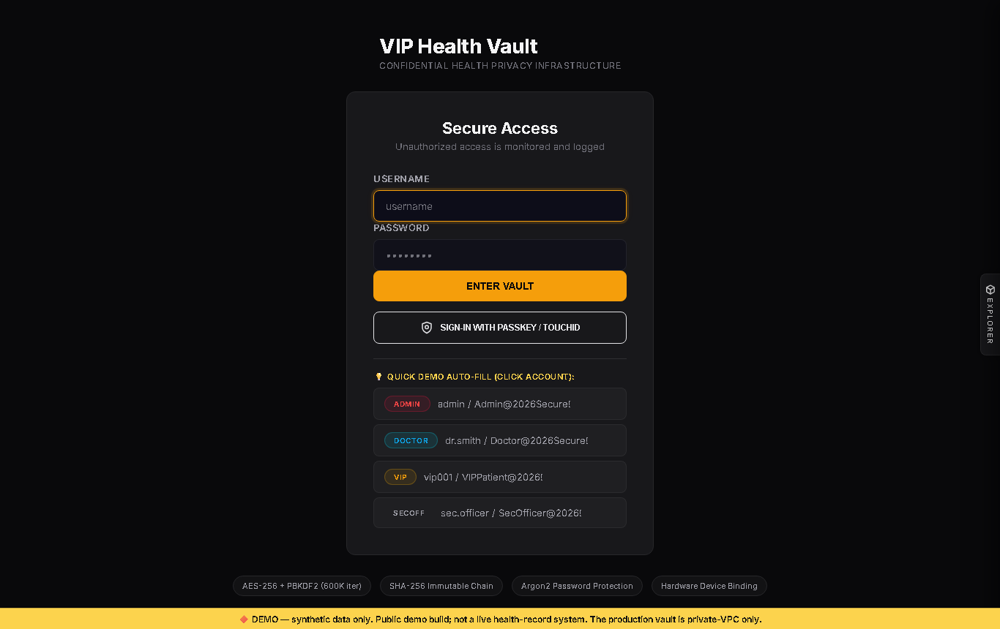
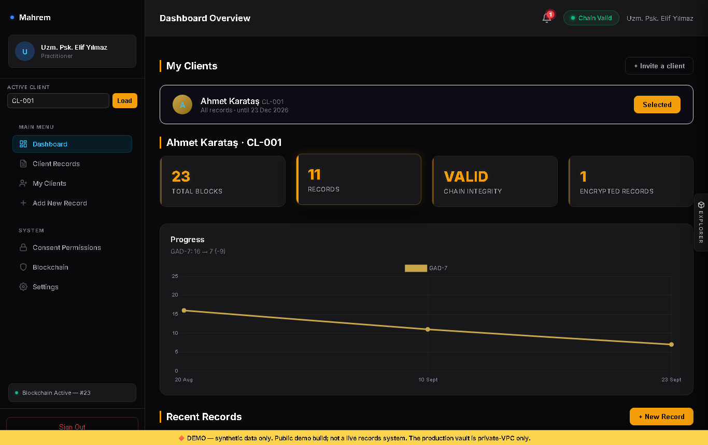
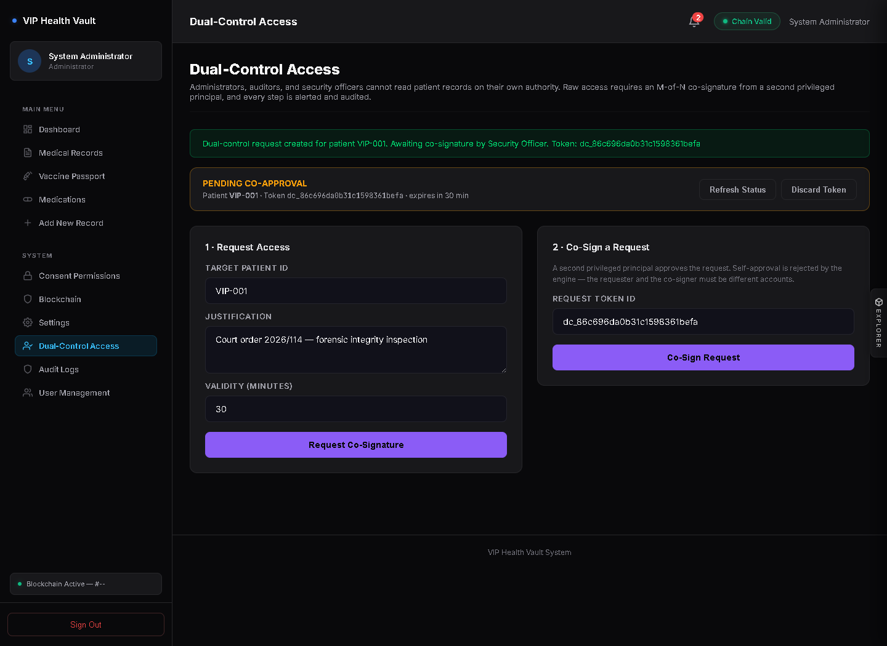
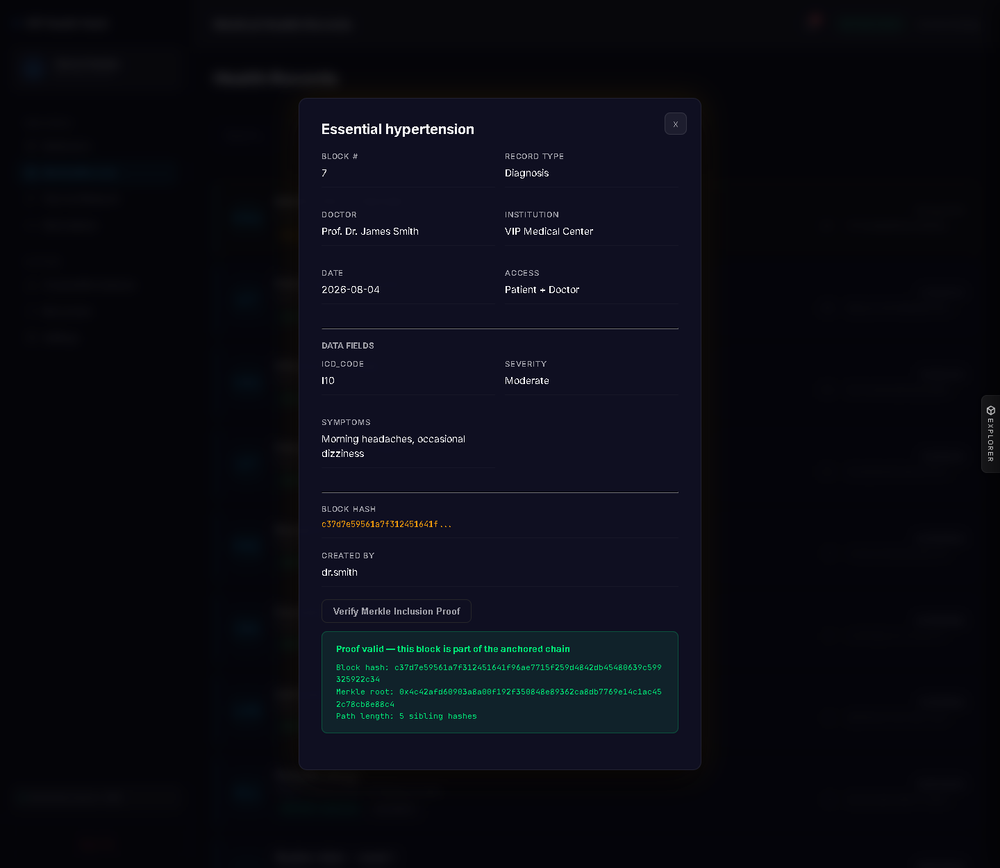

# VIP Health Vault (v5.0.0) — Stealth VIP Health Privacy Platform

> **Isolated, High-Security Medical Privacy Vault for High-Net-Worth Individuals, Executive Cabinets, and Defense Personnel.**

---

## 📸 Interface

Captured from a running instance seeded by demo mode — the chart, the trends and the
hashes below are what the application actually produces.

| Stealth login | VIP patient dashboard |
| :---: | :---: |
|  |  |

| Dual-Control access request | Merkle inclusion proof |
| :---: | :---: |
|  |  |

---

> 💡 **Public Ingress Architecture Note**: By security design, **VIP Health Vault** enforces strict private subnet CIDR isolation (`IPAllowlistMiddleware`) and per-device hardware passkeys. As a consequence, the application cannot and should not be hosted on public SaaS URLs (`0.0.0.0/0`) — it is intended to be run locally or inside a private VPC. See [Quick Start](#-quick-start) to bring the vault up on your own machine.

---

## 🛡️ Feature Implementation & Security Defense Matrix

To maintain 100% technical honesty during code reviews and security audits, the system explicitly distinguishes between **natively working code implementations** and **pluggable enterprise abstractions**:

| Security Component | Implementation Status | Enforcing Class / File | Technical Guarantee |
| :--- | :---: | :--- | :--- |
| **Local Merkle Hash-Chain** | **LIVE / WORKING** | `core.services.notarizer.BlockchainNotarizer` | Local Merkle-root hash-chain (`ADR-0001`), re-anchored after every committed write. The anchor is an **HMAC-SHA256 signature of the Merkle root** under the server's KMS key — a verifiable commitment only the key-holder can produce, deliberately not a public-chain transaction hash. Verification recomputes and checks that signature, so a tampered block fails as "Anchor signature invalid." Zero Web3/RPC dependencies. Per-record inclusion proofs are verifiable from the record view (`GET /api/v1/records/proof/{patient_id}/{block_index}`). |
| **Passkey / FIDO2 Auth** | **LIVE / WORKING** | `core.webauthn.verify_assertion` | Native browser WebAuthn API + `secp256r1` (ES256) assertion verification in Python: single-use challenge, origin and rpId binding, User Present flag, and signature-counter clone detection. No credential is ever pre-seeded. |
| **Encryption at Rest** | **LIVE / WORKING** | `core.services.record_service._encrypt_at_rest` | Every clinical payload is AES-256-GCM encrypted on disk under a KMS-derived, patient-scoped key (`core.security.derive_rest_secret`). The chain store holds only ciphertext — a stolen `projects/` backup cannot be read **as long as the signing key is kept out of that backup** (env var or OS keyring, not the on-disk `.private_key` file). Production refuses to boot with an unconfigured key rather than silently minting one. The server decrypts for authorized sessions; a per-record password layer adds server-blind confidentiality on top. Key backup & rotation: [KEY_MANAGEMENT.md](docs/KEY_MANAGEMENT.md). |
| **Tamper-Evident Access Ledger** | **LIVE / WORKING** | `database.audit_storage.append_access_log` / `verify_access_log_integrity` | Every read and clinician view is a hash-linked entry carrying `seq` + `prev_hash` + `hash`. Deleting or altering any past access event breaks the chain and is reported by sequence number. The record owner reads their own trail and its integrity verdict — you cannot silently erase having looked at a VIP's chart. |
| **Append-Only Medical Correction** | **LIVE / WORKING** | `POST /api/v1/records/{patient_id}/{block_index}/correct` | A record is never overwritten. A correction is appended as a new block referencing the original; both versions stay on the chain, the record carries the correction's author and reason, and the superseded content is still retrievable (`?version=original`). This is why append-only fits medicine — a clinical record is corrected, not rewritten. |
| **Patient-Controlled Consent** | **LIVE / WORKING** | `backend.routers.consent._require_consent_owner` | Only the patient who owns the chart may grant or revoke clinical access — practitioners and administrators cannot self-authorize; they must use the audited Break-Glass override. |
| **Dual-Control M-of-N Engine** | **LIVE / WORKING** | `core.services.dual_control.DualControlEngine` | Blocks raw record access by every non-clinical operator role — admin, auditor, security officer — with `403 Forbidden` until a *different* privileged principal co-signs. Self-approval is rejected; tokens are bound to one patient and expire. Drivable from the Dual-Control Access screen. |
| **Network IP Allowlist** | **LIVE / WORKING** | `backend.middleware.ip_allowlist.resolve_secure_client_ip` | Direct socket peer host verification. Prevents `X-Forwarded-For` header spoofing. |
| **Immutable Decrypt Access Log** | **LIVE / WORKING** | `backend.routers.records.decrypt_record` | Writes immutable `RECORD_DECRYPTED` log entry to LMDB and SQLite access logs. |
| **Hardware Passkey Revocation** | **LIVE / WORKING** | `POST /api/v1/auth/webauthn/revoke` | Revokes stolen hardware credentials with Dual-Control authorization. |
| **XSS Defence in Depth** | **LIVE / WORKING** | `backend.middleware.xss_protection` / `static.js.modules.actions` | Clinical text is stored verbatim and escaped at render; the CSP then forbids inline script outright (`script-src 'self'`, no `unsafe-inline`, no `unsafe-eval`), so encoding and execution are two independent layers. |
| **Encrypted File Attachments** | **LIVE / WORKING** | `core.services.attachment_store.AttachmentStore` | Record attachments (e.g. imaging/DICOM) are AES-encrypted, then kept in the same LMDB store as the chain, content-addressed by the SHA-256 of the ciphertext. No external service, no network egress — the blob sits on the same disk as the records it belongs to. |
| **KMS Envelope Encryption** | **PLUGGABLE ABSTRACTION** | `core.kms.provider.KMSProvider` / `SoftwareKMSProvider` | Software PBKDF2 provider natively working; AWS KMS / HashiCorp Vault drivers scaffolded. |

---

## ⚡ Quick Start

### Prerequisites
- Python 3.10+
- Virtualenv (`python -m venv venv`)

### Installation & Run

```bash
# 1. Clone repository
git clone https://github.com/calsgnkadir/health-blockchain.git
cd health-blockchain

# 2. Install dependencies
pip install -r requirements.txt

# 3. Launch application server in demo mode
ENVIRONMENT=development VHV_DEMO_MODE=true   python -m uvicorn backend.main:app --host 127.0.0.1 --port 8000
```

Access the Stealth Vault Web Console at: `http://127.0.0.1:8000`

### Demo Mode

`VHV_DEMO_MODE=true` seeds four demo accounts and one worked example chart for
patient `VIP-001` — four weeks of a cardiology follow-up with vital sign trends, a
severe allergy, a prescription, a vaccination and one AES-256 encrypted record — so
a first run opens on a working vault rather than eight empty panels. Nothing is
seeded in any other configuration, and an existing chart is never overwritten.

| Account | Password | Shows |
| :--- | :--- | :--- |
| `vip001` | `VIPPatient@2026!` | the patient's own chart, consent grants, passkey enrolment |
| `dr.smith` | `Doctor@2026Secure!` | consented clinical access and the Break-Glass override |
| `admin` | `Admin@2026Secure!` | records locked by Dual-Control until a second principal co-signs |
| `sec.officer` | `SecOfficer@2026!` | the co-signing side of Dual-Control |

The encrypted demo record opens with `DemoRecord@2026!`.

Optional environment variables: `VHV_WEBAUTHN_RP_ID` / `VHV_WEBAUTHN_ORIGINS`
pin passkey verification to a specific host — see `.env.example`.

---

## 🧪 Running Automated Test Suite

```bash
python -m unittest discover -s tests -p "test_*.py"
```

---

## ⚖️ Compliance & Governance

- **GDPR / KVKK (live)**: Local data sovereignty (records never leave the private deployment), time-bound consent with automatic expiry, and a full cryptographic access audit trail.
- **GDPR / KVKK (live)**: Identity pseudonymization is wired into the write path — the clinical chain store is keyed by a deterministic `anon_id` (HMAC of the patient id), never the raw identifier, so the block store holds only opaque pseudonyms; an authorized admin resolves the mapping, and it is verifiable end-to-end.
- **GDPR / KVKK (planned)**: Key-destruction erasure (right to be forgotten on an append-only chain) is still scaffolded, not yet wired — see the [Roadmap](#-roadmap) and `docs/GDPR_KVKK_COMPLIANCE.md`.
- **ISO 27001 / INFOSEC**: Cryptographic access audit logs and Dual-Control co-signatures for privileged operations.
- **Institutional Gate**: Satisfies Private VPC isolation and out-of-band identity onboarding requirements ([PRIVATE_VPC_DEPLOYMENT.md](docs/PRIVATE_VPC_DEPLOYMENT.md)).

---

## 🧭 Roadmap

The vault stands on two pillars: a **tamper-evident chain** (integrity) and
**confidentiality** for VIP health records. Work is sequenced so each step is
independently shippable with the test suite green.

| Status | Item | Pillar |
| :---: | :--- | :--- |
| ✅ done | Signed, append-only hash-chain with per-block Merkle inclusion proofs | Integrity |
| ✅ done | Passkey/FIDO2 auth, patient-owned consent, Dual-Control for operators | Confidentiality |
| ✅ done | Verified WebAuthn, render-time output encoding, strict CSP | Confidentiality |
| ✅ done | **Encryption at rest** — every clinical payload AES-256-GCM encrypted on disk with a KMS-derived, patient-scoped key (server decrypts for authorized sessions); optional password layer on top for extra-sensitive records | Confidentiality |
| ✅ done | **Tamper-evident access trail** — every read is a hash-linked ledger entry (`seq` + `prev_hash` + `hash`); deleting or altering one breaks the chain. The patient sees who accessed their records and a live integrity verdict under *Who Accessed My Records* | Both |
| ✅ done | **Medical correction flow** — a record is never overwritten; a correction is appended as a new block. The current and original versions both stay on the chain, the record is flagged with the correction's author and reason, and `?version=original` returns the superseded content | Integrity |
| ✅ done | **Identity pseudonymization** — the clinical chain store is keyed by a deterministic `anon_id` (HMAC of the patient id), never the raw identifier; the write path persists the mapping so an authorized admin can resolve it | Confidentiality |
| 📋 planned | Key-destruction erasure (GDPR/KVKK right to be forgotten on an append-only chain) | Confidentiality |
| 📋 planned | External Merkle-root anchoring (RFC 3161 / signed daily root) and HSM-backed signing key | Integrity |
